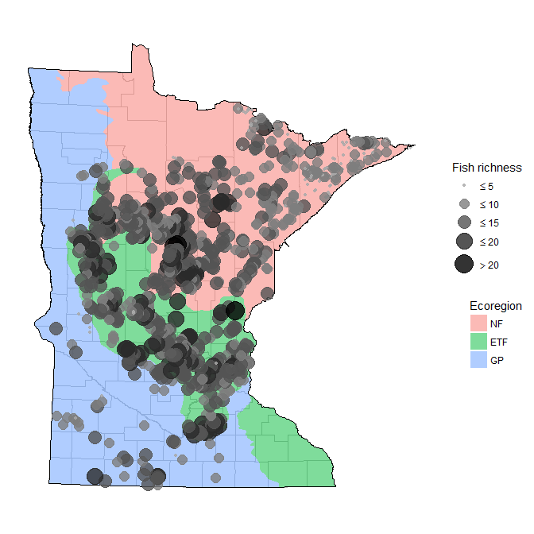
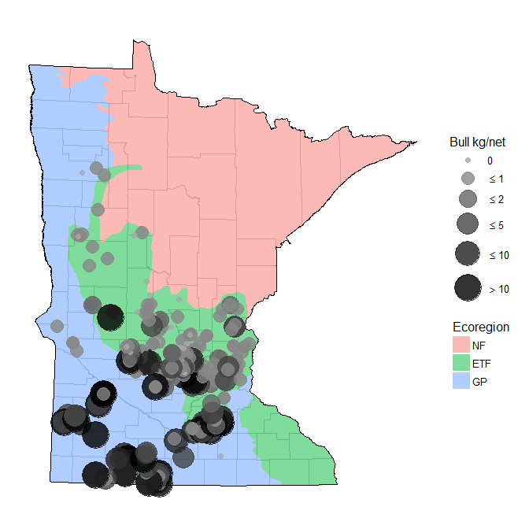
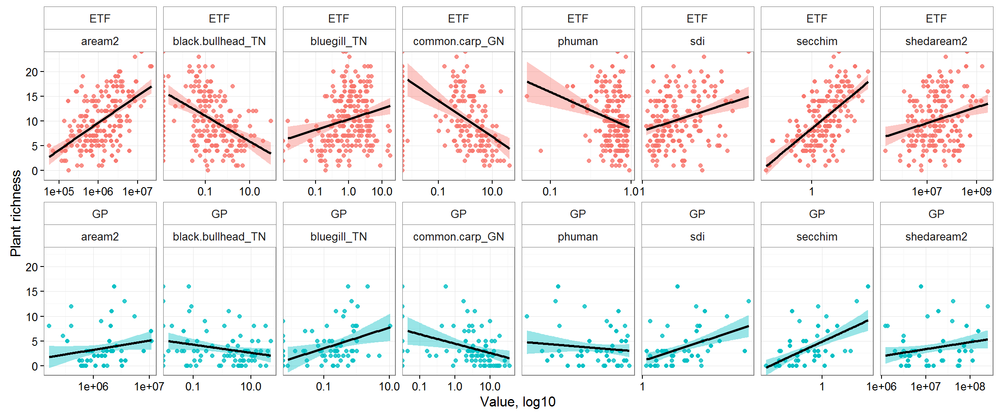
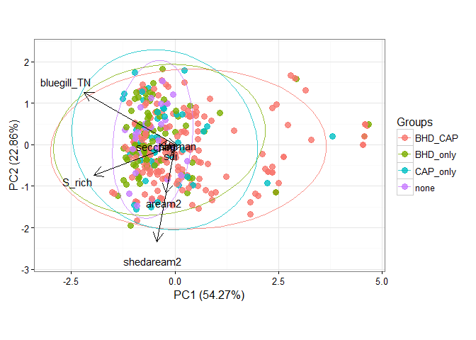
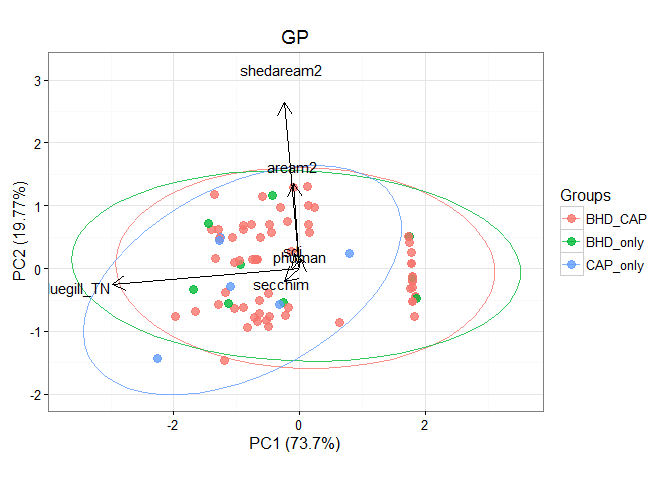
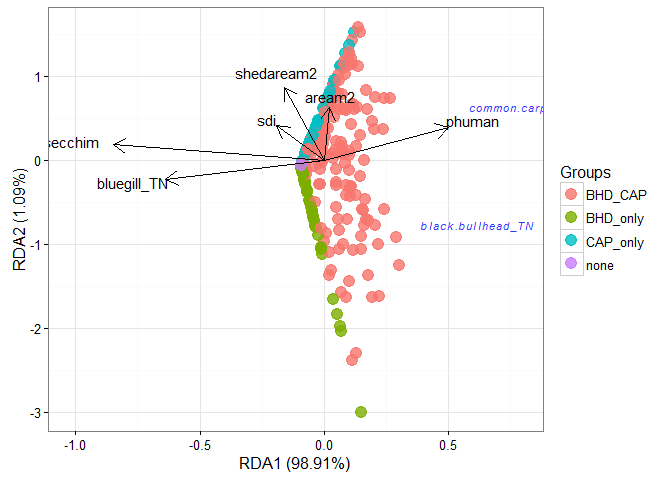

# README

#### Files

All data created in `R\dat_proc.R`.  Source data in the ignore folder were created elsewhere.

* `fish_all.RData` DNR trapnet/gillnet fish data for all years, months, and survey types.  Dat are one unique record per fish.  Carp, black bullhead, yellow bullhead, bluegill, black crappie, white crappie, yellow perch, northern pike, and walleye are identified, all other species labelled as 'other'. Total fish length is reported in mm. Data are only for July, August, September, all survey types. Includes true zeroes. 

* `fish_dat.RData` Same as `fish_all.RData` but data are converted to CPUE, surveys are Jul/Aug/Sep, and 'standard population assessments' and 'resurveys'.  CPUE is estimated as total fish weight (kg) divided by effort, unique to species, date, lake, and gear type.  CPUE was estimated separately for trapnet, gillnet. Length to weight equations were from the Handbook of Freshwater Fishery Biology. The arguments to `cpue_fun` show the species and gear type combos, including parameters for length/weight conversions.  Bullhead are black and yellow bullhead combined, and crappie are white and black crappie combined. Species are not separated by adult or yoy. 

* `fishveg_dat.RData` combined fisheries and veg data, veg data summarized by total rich and subm rich for each lake.  Fish and veg data combined if the survey was in the same year. Covariates for each lake include UTM coordinates, ecoregion, watershed area, lake depth, lake area, percent human development in watershed, SDI, and secchi depth.   

* `map_dat.RData` Several R objects for creating plots. 

* `veg_dat.RData` DNR veg transect data from 1992 to present. Format is dow, date, transect, species, and abundance category.  NULL abundance entries are not removed, these are species in the survey but not observed on a transect.  Note that there were no lakes in the dataset that had zero veg.  

#### Exploratory analysis

<!-- -->
  
<!-- -->

<!-- -->

<!-- --><!-- -->

<!-- -->
