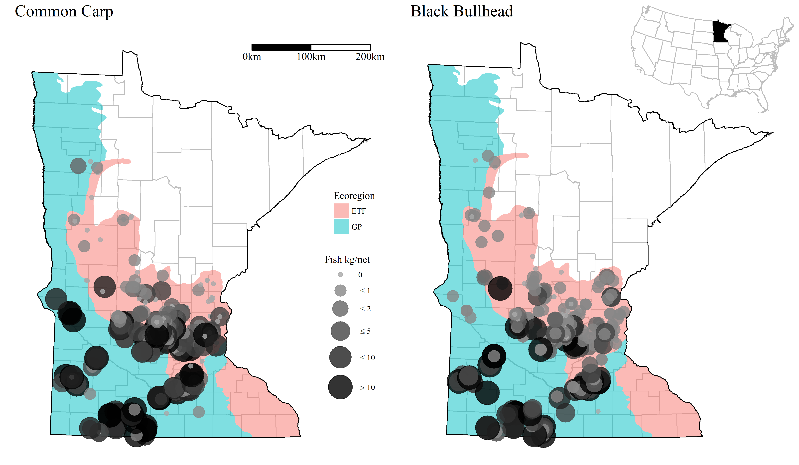
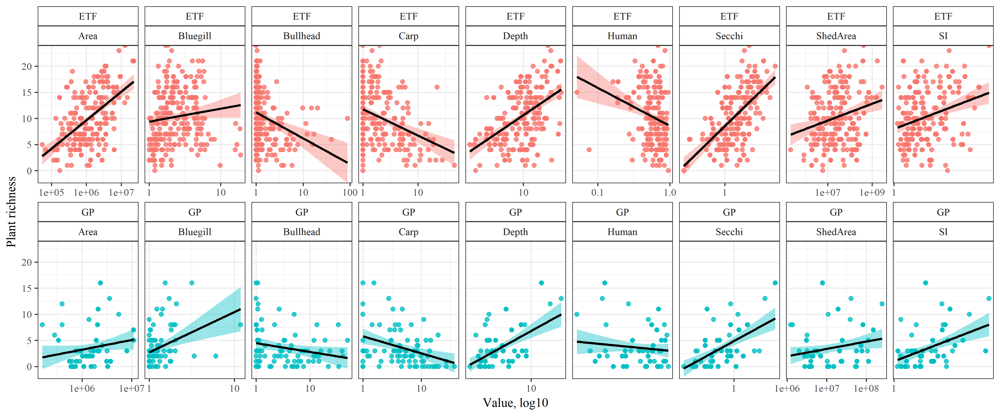
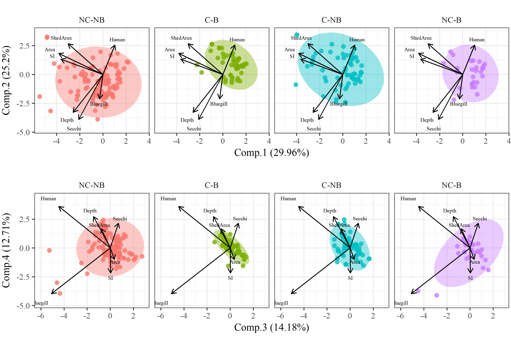
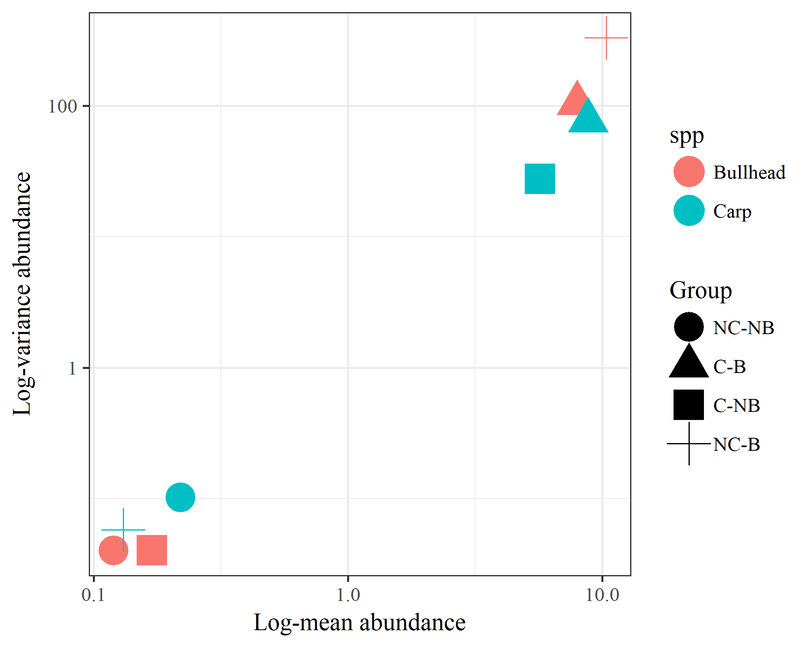

README
------

#### Files

All data created in `R\dat_proc.R`. Source data in the ignore folder
were created elsewhere.

-   `country.RData` SpatialPolygonsDataFrame of US conterminous state
    borders

-   `fish_dat.RData` Same as `fish_all.RData` but data are converted to
    CPUE, surveys are Jul/Aug/Sep, and 'standard population assessments'
    and 'resurveys'. CPUE is estimated as total fish weight (kg) divided
    by effort, unique to species, date, lake, and gear type. CPUE was
    estimated separately for trapnet, gillnet. Length to weight
    equations were from the Handbook of Freshwater Fishery Biology. The
    arguments to `cpue_fun` show the species and gear type combos,
    including parameters for length/weight conversions. Bullhead are
    black and yellow bullhead combined, and crappie are white and black
    crappie combined. Species are not separated by adult or yoy.

-   `fishveg_dat.RData` combined fisheries and veg data, veg data
    summarized by total rich and subm rich for each lake. Fish and veg
    data combined if the survey was in the same year. Covariates for
    each lake include UTM coordinates, ecoregion, watershed area, lake
    depth, lake area, percent human development in watershed, SDI, and
    secchi depth.

-   `map_dat.RData` Several R objects for creating plots.

-   `mnstate.RData` SpatialPolygonsDataFrame of MN state boundaries

-   `veg_dat.RData` DNR veg transect data from 1992 to present. Format
    is dow, date, transect, species, and abundance category. NULL
    abundance entries are not removed, these are species in the survey
    but not observed on a transect. Note that there were no lakes in the
    dataset that had zero veg.

#### Summary table

<table>
<thead>
<tr class="header">
<th align="left">Ecoregion</th>
<th align="left">Variable</th>
<th align="left">Ave. (Med.)</th>
<th align="left">Var.</th>
<th align="left">Min./Max.</th>
</tr>
</thead>
<tbody>
<tr class="odd">
<td align="left">ETF</td>
<td align="left">SpeciesRichness</td>
<td align="left">10.3 (10)</td>
<td align="left">27.6</td>
<td align="left">0 / 24</td>
</tr>
<tr class="even">
<td align="left"></td>
<td align="left">Carp</td>
<td align="left">2.1 (0.4)</td>
<td align="left">23</td>
<td align="left">0 / 45.1</td>
</tr>
<tr class="odd">
<td align="left"></td>
<td align="left">Bullhead</td>
<td align="left">1.4 (0.1)</td>
<td align="left">42.6</td>
<td align="left">0 / 87.4</td>
</tr>
<tr class="even">
<td align="left"></td>
<td align="left">Bluegill</td>
<td align="left">1.9 (1.1)</td>
<td align="left">6.7</td>
<td align="left">0 / 18</td>
</tr>
<tr class="odd">
<td align="left"></td>
<td align="left">Area</td>
<td align="left">2.5 (1.4)</td>
<td align="left">12.3</td>
<td align="left">0.1 / 22.5</td>
</tr>
<tr class="even">
<td align="left"></td>
<td align="left">Depth</td>
<td align="left">11.2 (9.7)</td>
<td align="left">50.5</td>
<td align="left">1.8 / 34.2</td>
</tr>
<tr class="odd">
<td align="left"></td>
<td align="left">Human</td>
<td align="left">0.6 (0.6)</td>
<td align="left">0</td>
<td align="left">0.1 / 1</td>
</tr>
<tr class="even">
<td align="left"></td>
<td align="left">SDI</td>
<td align="left">1.7 (1.5)</td>
<td align="left">0.4</td>
<td align="left">1.1 / 4.4</td>
</tr>
<tr class="odd">
<td align="left"></td>
<td align="left">Secchi</td>
<td align="left">1.6 (1.4)</td>
<td align="left">0.7</td>
<td align="left">0.3 / 5.4</td>
</tr>
<tr class="even">
<td align="left"></td>
<td align="left">ShedArea</td>
<td align="left">112.5 (28.9)</td>
<td align="left">77601.3</td>
<td align="left">0.2 / 2808.1</td>
</tr>
<tr class="odd">
<td align="left">GP</td>
<td align="left">SpeciesRichness</td>
<td align="left">3.6 (3)</td>
<td align="left">13.6</td>
<td align="left">0 / 16</td>
</tr>
<tr class="even">
<td align="left"></td>
<td align="left">Carp</td>
<td align="left">6.1 (3.7)</td>
<td align="left">47.8</td>
<td align="left">0 / 36</td>
</tr>
<tr class="odd">
<td align="left"></td>
<td align="left">Bullhead</td>
<td align="left">5.8 (1.9)</td>
<td align="left">95</td>
<td align="left">0 / 48.4</td>
</tr>
<tr class="even">
<td align="left"></td>
<td align="left">Bluegill</td>
<td align="left">0.5 (0.1)</td>
<td align="left">1.8</td>
<td align="left">0 / 10.8</td>
</tr>
<tr class="odd">
<td align="left"></td>
<td align="left">Area</td>
<td align="left">2.3 (1.5)</td>
<td align="left">6.7</td>
<td align="left">0.2 / 10.9</td>
</tr>
<tr class="even">
<td align="left"></td>
<td align="left">Depth</td>
<td align="left">4.7 (3.4)</td>
<td align="left">13.7</td>
<td align="left">1.5 / 25.3</td>
</tr>
<tr class="odd">
<td align="left"></td>
<td align="left">Human</td>
<td align="left">0.7 (0.8)</td>
<td align="left">0</td>
<td align="left">0.4 / 0.9</td>
</tr>
<tr class="even">
<td align="left"></td>
<td align="left">SDI</td>
<td align="left">1.7 (1.5)</td>
<td align="left">0.3</td>
<td align="left">1 / 3.5</td>
</tr>
<tr class="odd">
<td align="left"></td>
<td align="left">Secchi</td>
<td align="left">0.8 (0.6)</td>
<td align="left">0.4</td>
<td align="left">0.2 / 3.5</td>
</tr>
<tr class="even">
<td align="left"></td>
<td align="left">ShedArea</td>
<td align="left">34.1 (10.8)</td>
<td align="left">2134.9</td>
<td align="left">1.2 / 249.4</td>
</tr>
</tbody>
</table>

    ##  var      vif             
    ##  Carp     1.40087938822791
    ##  Bullhead 1.32609969244421
    ##  Bluegill 1.2967275170074 
    ##  Secchi   2.31599398230004
    ##  SDI      1.34263804704789
    ##  Human    1.22289758460126
    ##  Area     1.65132535880825
    ##  ShedArea 1.61081633407663
    ##  Depth    2.36527586392161
    ## 
    ## All variables have VIF < 10, max VIF 2.37

    ## [1] "Carp"     "Bullhead" "Bluegill" "Secchi"   "SDI"      "Human"   
    ## [7] "Area"     "ShedArea" "Depth"

#### Figures

#### Between group differences

    library(vegan)
    library(tidyverse)
    library(mvabund)

    # prep data
    merged_2 <- read.csv("ignore/merged_2.csv")

    d <- merged_2[, c(
      "S_rich", "common.carp_GN", "black.bullhead_TN", "bluegill_TN",
      "secchim", "sdi", "phuman", "aream2", "shedaream2", "ecoreg", "depthm"
    )]
    names(d) <- c(
      "SpeciesRichness", "Carp", "Bullhead", "Bluegill", "Secchi", "SI",
      "Human", "Area", "ShedArea", "Ecoregion", "Depth"
    )
    levels(d$Ecoregion) <- c("Forest", "Plain")

    d <- within(d, {
      Bullhead.cut <- cut(Bullhead, c(-Inf, 0, 0.5, 1, 2, 5, 10, 20, Inf))
      Carp.cut <- cut(Carp, c(-Inf, 0, 0.5, 1, 2, 5, 10, 20, Inf))
      Bullhead.plusMin <- Bullhead + min(Bullhead[Bullhead > 0])
      Carp.plusMin <- Carp + min(Carp[Carp > 0])
      Bluegill.plusMin <- Bluegill + min(Bluegill[Bluegill > 0])
    })
    d$AnyCarp <- ifelse(d$Carp > 1, "C", "NC") ## 1 is a value for Carp and bullhead when impact becomes visible
    d$AnyBullhead <- ifelse(d$Bullhead > 1, "B", "NB")
    d$Group <- factor(paste0(d$AnyCarp, "-", d$AnyBullhead))
    d$Group <- relevel(d$Group, "NC-NB")
    d1 <- subset(d, ShedArea < 100000000 & Area < 10000000)

    # get distance matrix of fish abundance
    abudist <- d1 %>% 
      select(Carp, Bullhead) %>% 
      vegdist

    # lake groups
    grps <- d1$Group

    # exploratory plot
    toplo <- d1 %>% 
      select(Carp, Bullhead, Group) %>% 
      gather('spp', 'abu', -Group) %>% 
      group_by(Group, spp) %>% 
      summarise(
        ave = mean(abu, na.rm = T), 
        vrc = var(abu, na.rm = T)
      )

    ggplot(toplo, aes(x = ave, y = vrc, colour = spp, shape = Group)) + 
      geom_point(size = 6) + 
      theme_bw() + 
      scale_x_log10('Log-mean abundance') + 
      scale_y_log10('Log-variance abundance')

    # get multivariate homogeneity of groups
    bdisper <- betadisper(abudist, grps)

    # test if one or more groups is more variable than the others
    # variance between group is not homogenous
    permutest(bdisper)

    ## 
    ## Permutation test for homogeneity of multivariate dispersions
    ## Permutation: free
    ## Number of permutations: 999
    ## 
    ## Response: Distances
    ##            Df Sum Sq Mean Sq      F N.Perm Pr(>F)    
    ## Groups      3 2.0485 0.68283 36.375    999  0.001 ***
    ## Residuals 235 4.4114 0.01877                         
    ## ---
    ## Signif. codes:  0 '***' 0.001 '**' 0.01 '*' 0.05 '.' 0.1 ' ' 1

    # multivariate abundance
    abund <- d1 %>% 
      select(Carp, Bullhead) %>% 
      mvabund

    # test for group (location) effecgt
    mod <- manyglm(abund ~ grps, family = 'negative.binomial')
    anova(mod)

    ## Time elapsed: 0 hr 0 min 6 sec

    ## Analysis of Deviance Table
    ## 
    ## Model: manyglm(formula = abund ~ grps, family = "negative.binomial")
    ## 
    ## Multivariate test:
    ##             Res.Df Df.diff   Dev Pr(>Dev)    
    ## (Intercept)    258                           
    ## grps           255       3 613.3    0.001 ***
    ## ---
    ## Signif. codes:  0 '***' 0.001 '**' 0.01 '*' 0.05 '.' 0.1 ' ' 1
    ## Arguments:
    ##  Test statistics calculated assuming uncorrelated response (for faster computation) 
    ##  P-value calculated using 999 resampling iterations via PIT-trap resampling (to account for correlation in testing).
