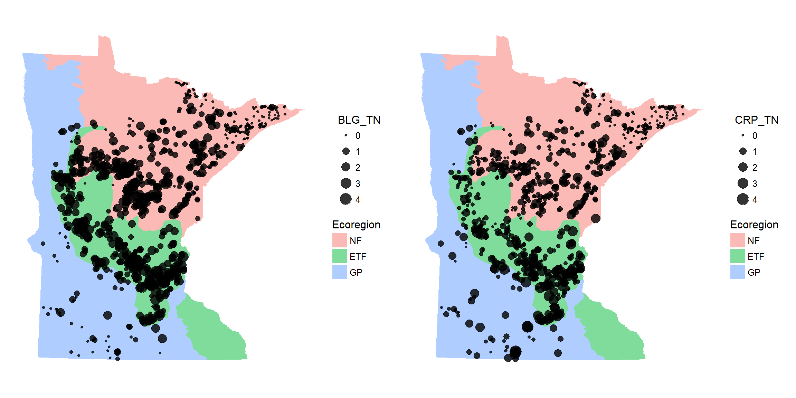
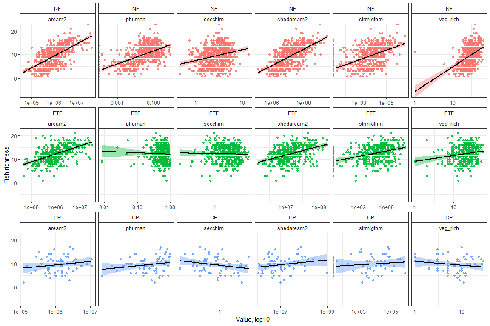
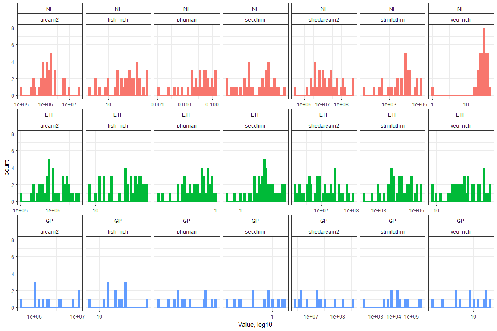

# README

#### Files

All data created in `R\dat_proc.R`.  Source data in the ignore folder were created elsewhere.

* `fish_dat.RData` DNR CPUE fisheries data, one row per fish.  Months are June through September, standard population assessments and re-surveys.  Sampling gear are gillnet, trapnets, beach seines (15, 50 ft), and backpack electrofishing.

* `fishveg_dat.RData` combined fisheries and veg data, fish data as total richness, veg data summarized by total rich and subm rich for each lake.  Fish and veg data combined if the survey was in the same year and a fisheries survey had all three sampling types (gillnet, trapnet, nearshore seine/electrofishing). Covariates for each lake include UTM coordinates, ecoregion, Strahler stream order out, watershed area, lake depth, lake area, percent human development in watershed, SDI, stream length in upper watershed, and secchi depth.  

* `map_dat.RData` Several R objects for creating plots. 

* `veg_dat.RData` DNR veg transect data from 1992 to present. Format is dow, date, transect, species, and abundance category.  NULL abundance entries are not removed, these are species in the survey but not observed on a transect.  Note that there were no lakes in the dataset that had zero veg.  

#### Exploratory analysis

<!-- --><!-- -->

Plant and fish richness vs potential explanatory variables, separated by ecoregion.
<!-- --><!-- --><!-- -->

