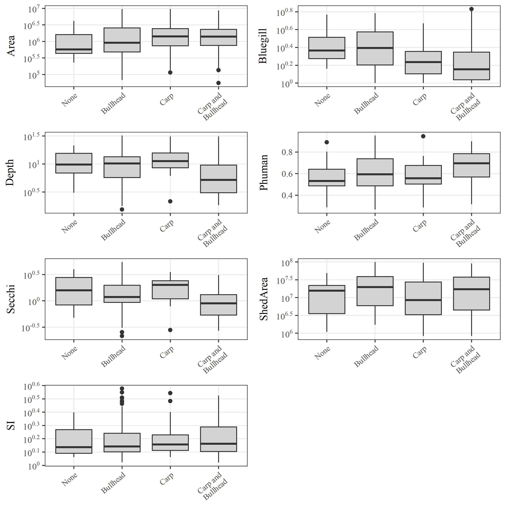

---
output:
  html_document:
    keep_md: yes
    toc: yes
    self_contained: no
    code_folding: hide
---

# README


```r
library(tidyr)
library(ggplot2)
library(purrr)
library(dplyr)
library(stargazer)
library(vegan)
library(maptools)
library(ggsn)
library(knitr)
library(ggord)
library(gridExtra)
library(FactoMineR)
source('R/funcs.R')

opts_chunk$set(fig.align = 'center', message = F, echo = T, cache = F, dev = 'png', dev.args = list(family = 'serif'), dpi = 400, fig.pos = '!h', warning = F, background = 'white', out.width = '60%',
  fig.process = function(x) {
  x2 = sub('-\\d+([.][a-z]+)$', '\\1', x)
  if (file.rename(x, x2)) x2 else x
  })
```

## Files

All data created in `R\dat_proc.R`.  Source data in the ignore folder were created elsewhere.

* `country.RData` SpatialPolygonsDataFrame of US conterminous state borders

* `fish_dat.RData` Same as `fish_all.RData` but data are converted to CPUE, surveys are Jul/Aug/Sep, and 'standard population assessments' and 'resurveys'.  CPUE is estimated as total fish weight (kg) divided by effort, unique to species, date, lake, and gear type.  CPUE was estimated separately for trapnet, gillnet. Length to weight equations were from the Handbook of Freshwater Fishery Biology. The arguments to `cpue_fun` show the species and gear type combos, including parameters for length/weight conversions.  Bullhead are black and yellow bullhead combined, and crappie are white and black crappie combined. Species are not separated by adult or yoy. 

* `fishveg_dat.RData` combined fisheries and veg data, veg data summarized by total rich and subm rich for each lake.  Fish and veg data combined if the survey was in the same year. Covariates for each lake include UTM coordinates, ecoregion, watershed area, lake depth, lake area, percent human development in watershed, SDI, and secchi depth.   

* `map_dat.RData` Several R objects for creating plots. 

* `mnstate.RData` SpatialPolygonsDataFrame of MN state boundaries

* `veg_dat.RData` DNR veg transect data from 1992 to present. Format is dow, date, transect, species, and abundance category.  NULL abundance entries are not removed, these are species in the survey but not observed on a transect.  Note that there were no lakes in the dataset that had zero veg.  

## Summary table


```r
# diagnostic plots

rev_fishdat <- read.csv('raw/d2.csv')

# format data
totab <- select(rev_fishdat, 
  SpeciesRichness, Carp, Bullhead, Bluegill, Secchi, SDI, Human, Area, ShedArea, Ecoregion, Depth
  ) %>% 
  rename(
    SI = SDI,
    Phuman = Human
  ) %>% 
  mutate(
    Ecoregion = factor(Ecoregion, levels = c('Forest', 'Plain'), labels = c('ETF', 'GP'))
  ) %>% 
  mutate(
    Area = Area * 1e-6,
    ShedArea = ShedArea * 1e-6
  ) %>% 
  gather('Variable', 'val', -Ecoregion) %>% 
  mutate(Variable = factor(Variable, 
                      levels = c('SpeciesRichness', 'Carp', 'Bullhead', 'Bluegill', 'Area', 'Depth', 'Phuman', 'SI', 'Secchi', 'ShedArea'))
         ) %>% 
  group_by(Ecoregion, Variable) %>% 
  summarise(
    Average = round(mean(val, na.rm = T), 1), 
    Median  = round(median(val, na.rm = T), 1),
    Var. = round(var(val, na.rm = T), 1), 
    Min. = round(min(val, na.rm = T), 1),
    Max. = round(max(val, na.rm = T), 1)
  ) %>% 
  unite('Min./Max.', Min., Max., sep = ' / ') %>% 
  ungroup %>% 
  mutate(
    Median = paste0('(', Median, ')'), 
    Ecoregion = ifelse(duplicated(Ecoregion), '', as.character(Ecoregion)),
    Var. = as.character(Var.)
  ) %>% 
  unite('Ave. (Med.)', Average, Median, sep = ' ')

write.csv(totab, 'raw/table1.csv', quote = F, row.names = F)
kable(totab)
```


Ecoregion   Variable          Ave. (Med.)   Var.    Min./Max.  
----------  ----------------  ------------  ------  -----------
ETF         SpeciesRichness   10.5 (10)     25.2    0 / 23     
            Carp              2.2 (0.4)     24.8    0 / 45.1   
            Bullhead          1.2 (0.1)     16.1    0 / 39.2   
            Bluegill          1.7 (1.2)     2       0 / 5.7    
            Area              1.8 (1.2)     3.7     0.1 / 9.4  
            Depth             11.3 (10.7)   44.4    1.8 / 32.1 
            Phuman            0.6 (0.6)     0       0.3 / 1    
            SI                1.7 (1.5)     0.3     1.1 / 3.8  
            Secchi            1.5 (1.3)     0.7     0.3 / 5.4  
            ShedArea          25 (19.1)     535.9   0.8 / 98.6 
GP          SpeciesRichness   3.3 (2)       13.6    0 / 16     
            Carp              6.5 (4.4)     51.5    0 / 36     
            Bullhead          5.5 (2)       78.7    0 / 39.6   
            Bluegill          0.3 (0.1)     0.5     0 / 5.1    
            Area              1.8 (1.5)     2.1     0.2 / 7.9  
            Depth             4.6 (3)       12.9    1.5 / 25.3 
            Phuman            0.7 (0.8)     0       0.4 / 0.9  
            SI                1.6 (1.4)     0.3     1 / 3.5    
            Secchi            0.8 (0.6)     0.4     0.2 / 3.5  
            ShedArea          21.4 (9.1)    631.9   1.4 / 82.2 


```r
merged_2<-read.csv("raw/merged_2.csv")
d <- merged_2[,c("common.carp_GN", "black.bullhead_TN", "bluegill_TN", 
                 "secchim", "sdi", "phuman", "aream2", "shedaream2", "depthm")]
names(d) <- c("Carp", "Bullhead", "Bluegill", "Secchi", "SDI", 
              "Human", "Area", "ShedArea", "Depth")
d <- log(1 + d)
vif_func(d)
```

```
##  var      vif             
##  Carp     1.40087938822791
##  Bullhead 1.32609969244421
##  Bluegill 1.2967275170074 
##  Secchi   2.31599398230004
##  SDI      1.34263804704789
##  Human    1.22289758460126
##  Area     1.65132535880825
##  ShedArea 1.61081633407663
##  Depth    2.36527586392161
## 
## All variables have VIF < 10, max VIF 2.37
```

```
## [1] "Carp"     "Bullhead" "Bluegill" "Secchi"   "SDI"      "Human"   
## [7] "Area"     "ShedArea" "Depth"
```

## Fig 1

```r
library(tidyverse)
library(maptools)
library(gridExtra)
library(grid)
library(RColorBrewer)
load(file = 'data/map_dat.RData')
load(file = 'data/country.RData')
load(file = 'data/mnstate.RData')

######
# maps

# get legend from an existing ggplot object
g_legend <- function(a.gplot){
  tmp <- ggplot_gtable(ggplot_build(a.gplot))
  leg <- which(sapply(tmp$grobs, function(x) x$name) == "guide-box")
  legend <- tmp$grobs[[leg]]
  return(legend)}

# format data for ggplot
state <- fortify(state)
ecoregs <- fortify(ecoregs)
counties <- fortify(counties)
ecoregs <- ecoregs[ecoregs$id %in% c(3, 4), ]
ecoregs$Ecoregion <- factor(ecoregs$id, levels = c(3, 4), 
  labels = c("ETF", "GP"))

# format fish data to same scale
brks <- c(-Inf, 0, 1, 2, 5, 10, Inf)
labs <- c('0', '< 1',  '< 2', '< 5', '< 10', '> 10')
toplo <- select(fishdat, utmx, utmy, common.carp_GN, black.bullhead_TN) %>% 
  mutate(
    common.carp_GN = cut(common.carp_GN, breaks = brks, labels = labs),
    black.bullhead_TN = cut(black.bullhead_TN, breaks = brks, labels = labs)
    )

# legend labels, color palette
leglabs <- list(expression(0), expression(phantom('')<=1), expression(phantom('')<=2), expression(phantom('')<=5), expression(phantom('')<=10), expression(phantom('')>10))
cols <- colorRampPalette(c('darkgrey', 'black'))(length(leglabs))

# carp cpue GN
p1 <- ggplot(state, aes(x = long, y = lat)) + 
  geom_polygon(data = counties, aes(x = long, y = lat, group = group), 
    fill = NA, colour = 'grey') +
  geom_polygon(data = ecoregs, aes(x = long, y = lat, group = group, fill= Ecoregion),  
    alpha = 0.5) +
  geom_polygon(fill = NA, colour = 'black') +
  geom_point(data = toplo, aes(x = utmx, y = utmy, size = common.carp_GN, color = common.carp_GN), alpha = 0.8) +
  scale_size_discrete('Fish kg/net', range = c(2, 12), labels = leglabs) + 
  scale_colour_manual('Fish kg/net', values = cols, labels = leglabs) +
  theme_classic() + 
  theme(axis.line=element_blank(),axis.text.x=element_blank(),
          axis.text.y=element_blank(),axis.ticks=element_blank(),
          axis.title.x=element_blank(),
          axis.title.y=element_blank(),
          panel.background=element_blank(),panel.border=element_blank(),panel.grid.major=element_blank(),
          panel.grid.minor=element_blank(),plot.background=element_blank(), 
          legend.box.just = 'right',
        legend.position = c(0.9, 0.37),
        plot.title = element_text(size = 18)
    ) +
  coord_equal() + 
  ggtitle('Common Carp') + 
  scalebar(location = 'topright', y.min = 5372428, y.max = 5472428, x.min = 761655.1, x.max = 761655.1, 
    dist=100, st.dist=.1, st.size = 4, height = 0.1)

# black bullhead CPUE TN
p2 <- ggplot(state, aes(x = long, y = lat)) + 
  geom_polygon(data = counties, aes(x = long, y = lat, group = group), 
    fill = NA, colour = 'grey') +
  geom_polygon(data = ecoregs, aes(x = long, y = lat, group = group, fill= Ecoregion),  
    alpha = 0.5) +
  geom_polygon(fill = NA, colour = 'black') +
  geom_point(data = toplo, aes(x = utmx, y = utmy, size = black.bullhead_TN, color = black.bullhead_TN), alpha = 0.8) +
  scale_size_discrete('Bull kg/net', range = c(2, 12), labels = leglabs) + 
  scale_colour_manual('Bull kg/net', values = cols, labels = leglabs) +
  theme_classic() + 
  theme(axis.line=element_blank(),axis.text.x=element_blank(),
          axis.text.y=element_blank(),axis.ticks=element_blank(),
          axis.title.x=element_blank(),
          axis.title.y=element_blank(),
          panel.background=element_blank(),panel.border=element_blank(),panel.grid.major=element_blank(),
          panel.grid.minor=element_blank(),plot.background=element_blank(), 
          legend.box.just = 'right', 
        legend.position = 'none', 
        plot.title = element_text(size = 18)
    ) +
  coord_equal() +
  ggtitle('Black Bullhead')

# inset
# inset map
country <- thinnedSpatialPoly(country, tolerance = 10000, topologyPreserve = TRUE, 
                              avoidGEOS = FALSE)
pinset <- ggplot(country, aes(x = long, y = lat, group = group)) + 
  geom_polygon(fill = NA, colour = 'grey') +
  geom_polygon(data = mnstate, aes(x = long, y = lat, group = group), 
    fill = 'black') + 
  theme_classic() + 
  theme(axis.line=element_blank(),axis.text.x=element_blank(),
    axis.text.y=element_blank(),axis.ticks=element_blank(),
    axis.title.x=element_blank(),
    axis.title.y=element_blank(),
    panel.background=element_blank(),panel.border=element_blank(),
    panel.grid.major=element_blank(),
    panel.grid.minor=element_blank(),plot.background=element_blank()#, 
          # legend.position = 'none'
    ) +
  coord_equal()

# save
# tiff('map.tif', height = 7, width = 12, units = 'in', compression = 'lzw', res = 300, family = 'serif')
grid.newpage()
v1 <- viewport(width = 1, height = 1, x = 0.25, y = 0.5) 
v2 <- viewport(width = 1, height = 1, x = 0.75, y = 0.5) 
v3 <- viewport(width = 0.28, height = 0.28, x = 0.89, y = 0.87)
print(p1, vp = v1) 
print(p2, vp = v2)
print(pinset, vp = v3)
```


```r
# dev.off()
```

## Fig 2

```r
######
# diagnostic plots
data(map_dat)

rev_fishdat <- read.csv("raw/d2.csv")

# format data
toplo <- select(rev_fishdat, 
  SpeciesRichness, Carp, Bullhead, Bluegill, Secchi, SDI, Human, Area, ShedArea, Ecoregion, Depth
  ) %>% 
  rename(
    SI = SDI,
    Phuman = Human
    ) %>% 
  mutate(
    Carp = 1 + Carp, 
    Bullhead = 1 + Bullhead, 
    Bluegill = 1 + Bluegill,
    Ecoregion = factor(Ecoregion, levels = c('Forest', 'Plain'), labels = c('Eastern Temperate Forests', 'Great Plains'))
  ) %>% 
  gather('var', 'val', -SpeciesRichness, -Ecoregion)
  
# create plot
p3 <- ggplot(toplo, aes(x = val, y = SpeciesRichness, fill = Ecoregion, colour = Ecoregion)) + 
  geom_point(pch = 21, alpha = 0.8) + 
  scale_x_log10('Value, log10',
                breaks = scales::trans_breaks("log10", function(x) 10^x),
                labels = scales::trans_format("log10", scales::math_format(10^.x))
                ) +
  # annotation_logticks(sides = "b") +
  scale_y_continuous('Plant richness', expand = c(0, 0)) + 
  stat_smooth(method ='lm', colour = 'black', se = TRUE) + 
  facet_wrap( ~ var, ncol = 9, scales = 'free_x') +
  theme_bw() + 
  theme(
    legend.position = 'top',
    legend.title = element_blank(),
    axis.text.x = element_text(size = 6),
    strip.background = element_rect(fill = "white"), 
    panel.grid.minor = element_blank()
  )

# save
# tiff('fig3.tif', height = 5, width = 12, units = 'in', compression = 'lzw', res = 300, family = 'serif')
p3
```


```r
# dev.off()
```

## Fig 3

```r
rev_fishdat <- read.csv("raw/d2.csv")

# format data
d<- select(rev_fishdat, 
  SpeciesRichness, Carp, Bullhead, Bluegill, Secchi, SDI, Human, Area, ShedArea, Ecoregion, Depth
  ) %>% 
  rename(
    SI = SDI,
    Phuman = Human
    ) %>% 
  mutate(
    Bluegill = 1 + Bluegill,
    Ecoregion = factor(Ecoregion, levels = c('Forest', 'Plain'), labels = c('Eastern Temperate Forests', 'Great Plains'))
  )
  
d <- d %>% 
  mutate(
    carp_cat = ifelse(Carp > 0, 'C_prs', 'C_abs'),
    bull_cat = ifelse(Bullhead > 0 , 'B_prs', 'B_abs'),
    abuall = Carp + Bullhead
    ) %>% 
  unite('Group', carp_cat, bull_cat, sep = ', ')

tomod <- d %>% 
  select(Bluegill, Depth, Secchi, Area, SI, ShedArea, Phuman) %>% 
  decostand(method = 'standardize')
ppp <- PCA(tomod, scale.unit = F, graph = F)
```
Eigen values:

```r
ppp$eig %>% round(3) %>% kable
```

          eigenvalue   percentage of variance   cumulative percentage of variance
-------  -----------  -----------------------  ----------------------------------
comp 1         2.202                   31.593                              31.593
comp 2         1.763                   25.285                              56.878
comp 3         0.921                   13.206                              70.084
comp 4         0.828                   11.881                              81.965
comp 5         0.541                    7.761                              89.726
comp 6         0.413                    5.930                              95.656
comp 7         0.303                    4.344                             100.000
Loadings:

```r
out <- ppp$var$coord %>% 
  round(3) %>% 
  as.data.frame %>% 
  select(-Dim.5) %>% 
  rename_(.dots = setNames(names(.), gsub('^Dim\\.', 'Comp ', names(.)))) %>% 
  rownames_to_column('var') %>% 
  arrange(var)

write.csv(out, 'raw/table4.csv', quote = F, row.names = F)  
kable(out)
```


var         Comp 1   Comp 2   Comp 3   Comp 4
---------  -------  -------  -------  -------
Area         0.699    0.509   -0.109    0.047
Bluegill     0.336   -0.440    0.149    0.814
Depth        0.667   -0.494    0.318   -0.192
Phuman      -0.308    0.418    0.799    0.016
Secchi       0.567   -0.602    0.175   -0.354
ShedArea     0.514    0.600    0.244    0.009
SI           0.690    0.410   -0.237    0.033


```r
mythm <- theme_bw(base_family = 'serif') +
  theme(
  strip.background = element_blank(), 
  plot.margin = margin(0, 2, 0, 2, "pt")
) 

##
# carp + bullhead and none lakes, separate points for carp/bullhead, jittered, no jitter
rngs <- c(1, 7)
    
brks <- c(-Inf, 0, 1, 5, 10, Inf)
labs <- c('0', '< 1', '< 5', '< 10', '> 10')

locs <- ppp %>% 
  .$ind %>% 
  .$coord %>% 
  as.data.frame %>% 
  select(Dim.1, Dim.2) %>% 
  rename(
    one = Dim.1, 
    two = Dim.2
  ) %>% 
  rownames_to_column('id')

toplo <- d %>% 
  select(Carp, Bullhead) %>% 
  rownames_to_column('id') %>% 
  gather('var', 'val', -id) %>% 
  group_by(id) %>% 
  nest %>% 
  mutate(var = map(data, function(x){
  
    if(sum(x$val) == 0)
      rep('None', 2)
    else 
      x$var
    
    } 
  )) %>% 
  unnest %>% 
  mutate(valcut = cut(val, breaks = brks, labels = labs)) %>% 
  select(id, var, val, valcut) %>% 
  left_join(locs, by = 'id') %>% 
  rename(Group = var)

# format fish data to same scale

# legend labels, color palette
leglabs <- list(expression(0), expression(phantom('')<=1), expression(phantom('')<=5), expression(phantom('')<=10), expression(phantom('')>10))

p <- ggord(ppp, vec_ext = 7, size = -1, txt = 4, arrow = 0.3, 
      repel = T, ellipse = F) + 
  geom_point(data = toplo, aes(size = valcut, fill = Group), pch = 21, alpha = 1) +
  scale_size_manual('Fish kg/net', values = c(1.5, 2.25, 3, 3.75, 5.5), labels = leglabs) +
  scale_fill_manual(values = c('lightblue', 'tomato1', 'yellow2')) + 
  mythm +
  guides(fill = guide_legend(override.aes = list(size = 3)))
# tiff('fig3.tif', height = 5, width = 4, units = 'in', compression = 'lzw', res = 300, family = 'serif')
p
```


```r
# dev.off()
```

## Fig 4

```r
sums <- d %>% 
  select(Depth, Secchi, Area, SI, ShedArea, Phuman, Bluegill, Group) %>% 
  gather('var', 'val', -Group) %>% 
  mutate(
    Group = factor(Group, 
                      levels = c('C_abs, B_abs', 'C_abs, B_prs', 'C_prs, B_abs', 'C_prs, B_prs'), 
                      labels = c('None', 'Bullhead', 'Carp', 'Carp and\nBullhead')
    )
  )
vrs <- sums$var %>% 
  unique %>% 
  sort

for(vr in vrs){

  toplo <- sums %>% 
    filter(var %in% vr)
  
  p <- ggplot(toplo, aes(x = Group, y = val)) + 
    geom_boxplot(fill = 'lightgrey') + 
    theme_bw(base_family = 'serif') +
    theme(strip.background = element_blank(), axis.title.x = element_blank(), panel.grid.minor = element_blank(), axis.text.x = element_text(angle = 40, size = 8, hjust = 1, vjust = 1))
  
  if(!vr %in% 'Phuman')
    p <- p + 
      scale_y_log10(vr,
                  breaks = scales::trans_breaks("log10", function(x) 10^x),
                  labels = scales::trans_format("log10", scales::math_format(10^.x))
                  )
    
  else
    p <- p + scale_y_continuous(vr)
  
  ind <- which(vrs == vr)
  assign(paste0('p', ind), p)


}

# fix widths
# align widths of plots in first column, first two
pA <- ggplot_gtable(ggplot_build(p1))
pB <- ggplot_gtable(ggplot_build(p2))
pC <- ggplot_gtable(ggplot_build(p3))
pD <- ggplot_gtable(ggplot_build(p4))
pE <- ggplot_gtable(ggplot_build(p5))
pF <- ggplot_gtable(ggplot_build(p6))
pG <- ggplot_gtable(ggplot_build(p7))

maxWidth = grid::unit.pmax(pA$widths[2:3], pB$widths[2:3], pC$widths[2:3], pD$widths[2:3], pE$widths[2:3], pF$widths[2:3], pG$widths[2:3])

pA$widths[2:3] <- maxWidth
pB$widths[2:3] <- maxWidth
pC$widths[2:3] <- maxWidth
pD$widths[2:3] <- maxWidth
pE$widths[2:3] <- maxWidth
pF$widths[2:3] <- maxWidth
pG$widths[2:3] <- maxWidth

grid.arrange(
  arrangeGrob(pA, pB, pC, pD, pE, pF, pG, ncol = 2)
)
```



## Fig S1


```r
######
# diagnostic plots
data(map_dat)

# format data
toplo <- select(fishdat, 
  S_rich, common.carp_GN, black.bullhead_TN, bluegill_TN, secchim, sdi, phuman, aream2, shedaream2, ecoreg, depthm
  ) %>% 
  mutate(
    common.carp_GN = 1 + common.carp_GN, 
    black.bullhead_TN = 1 + black.bullhead_TN, 
    bluegill_TN = 1 + bluegill_TN,
    ecoreg = factor(ecoreg, levels = c('eastern temperate forests', 'great plains'), labels = c('ETF', 'GP'))
  ) %>% 
  rename(
    SpeciesRichness = S_rich, 
    Carp = common.carp_GN,
    Bullhead = black.bullhead_TN, 
    Bluegill = bluegill_TN,
    Secchi = secchim, 
    SI = sdi, 
    Phuman = phuman, 
    Area = aream2,
    ShedArea = shedaream2,
    Depth = depthm, 
    Ecoregion = ecoreg
  ) %>% 
  gather('var', 'val', -SpeciesRichness, -Ecoregion)
  
# create plot
p <- ggplot(toplo, aes(x = val, y = SpeciesRichness, fill = Ecoregion, colour = Ecoregion)) + 
  geom_point(pch = 21, alpha = 0.8) + 
  scale_x_log10('Value, log10',
                breaks = scales::trans_breaks("log10", function(x) 10^x),
                labels = scales::trans_format("log10", scales::math_format(10^.x))
                ) +
  scale_y_continuous('Plant richness', expand = c(0, 0)) + 
  stat_smooth(method ='lm', colour = 'black', se = TRUE) + 
  facet_wrap(Ecoregion ~ var, ncol = 9, scales = 'free_x') + 
  theme_bw() + 
  theme(
    legend.position = 'none',
    strip.background = element_rect(fill = "white"), 
    panel.grid.minor.x = element_blank(),
    axis.text.x = element_text(size = 6)
    )

# save
# tiff('fig3.tif', height = 5, width = 12, units = 'in', compression = 'lzw', res = 300, family = 'serif')
p
```


```r
# dev.off()
```

## MRPP all groups

```r
# MRPP to test differences among groups (by mean and/or variance of dissimilarities)
# significant values means that groupings were moree different than would be expected by chance
# delta statistics for each group indicates relative dissimilarity within groups
# higher delta is more dissimilar within group
mrpp(tomod, grouping = d$Group)
```

```
## 
## Call:
## mrpp(dat = tomod, grouping = d$Group) 
## 
## Dissimilarity index: euclidean 
## Weights for groups:  n 
## 
## Class means and counts:
## 
##       C_abs, B_abs C_abs, B_prs C_prs, B_abs C_prs, B_prs
## delta 3.103        3.904         3.34        3.161       
## n     20           64           28           131         
## 
## Chance corrected within-group agreement A: 0.03475 
## Based on observed delta 3.372 and expected delta 3.494 
## 
## Significance of delta: 0.001 
## Permutation: free
## Number of permutations: 999
```

## MRPP multiple comparisons

```r
# pairwise comparisons of groups with MRPP
grps <- d$Group %>% unique
grps <- combn(grps, 2)
pval <- rep(NA, ncol(grps))
aval <- rep(NA, ncol(grps))
for(col in 1:ncol(grps)){
  grp <- d$Group %in% grps[, col, drop = TRUE]
  res <- mrpp(tomod[grp, ], d$Group[grp])
  pval[col] <- res$Pvalue
  aval[col] <- res$A
}

# adjust p-values using holm sequential bonferroni
# pval <- p.adjust(pval, method = 'holm')

# pval as t/f
vecs <- rep(FALSE, ncol(grps))
vecs[pval < 0.05] <- TRUE
names(vecs) <- paste(grps[1, ], grps[2, ], sep = '-')

# group membership based on multiple comparisons
multcompView::multcompLetters(vecs)$Letters
```

```
## C_prs, B_prs C_abs, B_prs C_prs, B_abs C_abs, B_abs 
##          "a"          "b"          "c"         "bc"
```

```r
rbind(grps, round(aval, 4))
```

```
##      [,1]           [,2]           [,3]           [,4]          
## [1,] "C_prs, B_prs" "C_prs, B_prs" "C_prs, B_prs" "C_abs, B_prs"
## [2,] "C_abs, B_prs" "C_prs, B_abs" "C_abs, B_abs" "C_prs, B_abs"
## [3,] "0.0206"       "0.0295"       "0.0216"       "0.0099"      
##      [,5]           [,6]          
## [1,] "C_abs, B_prs" "C_prs, B_abs"
## [2,] "C_abs, B_abs" "C_abs, B_abs"
## [3,] "0.0034"       "0.0016"
```
