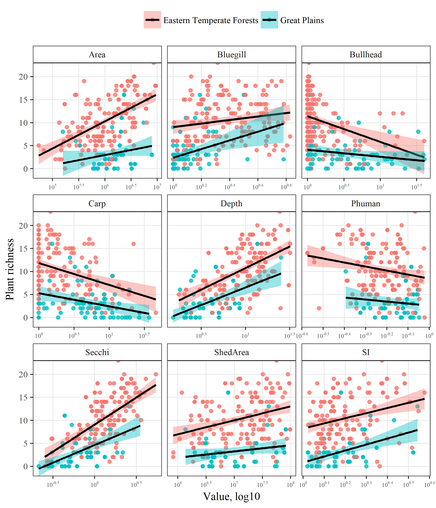
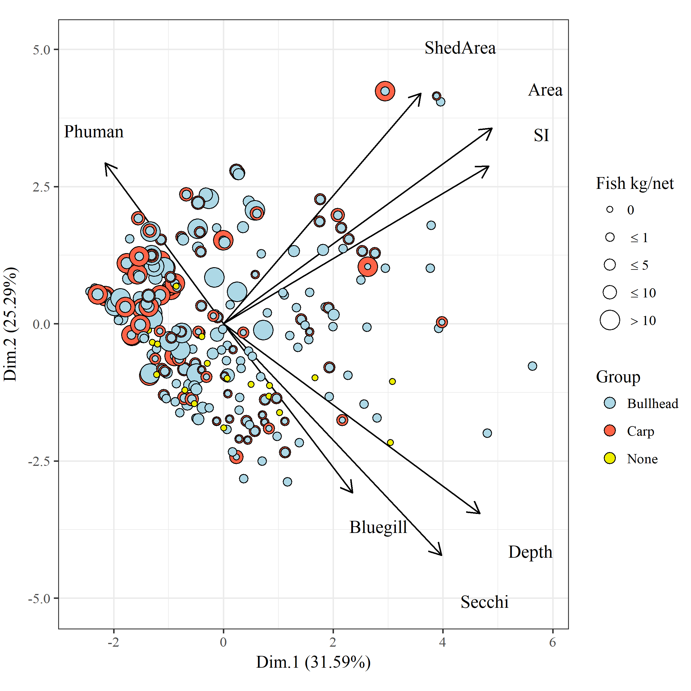

---
output:
  html_document:
    keep_md: yes
    toc: no
    self_contained: no
---

## README


#### Files

All data created in `R\dat_proc.R`.  Source data in the ignore folder were created elsewhere.

* `country.RData` SpatialPolygonsDataFrame of US conterminous state borders

* `fish_dat.RData` Same as `fish_all.RData` but data are converted to CPUE, surveys are Jul/Aug/Sep, and 'standard population assessments' and 'resurveys'.  CPUE is estimated as total fish weight (kg) divided by effort, unique to species, date, lake, and gear type.  CPUE was estimated separately for trapnet, gillnet. Length to weight equations were from the Handbook of Freshwater Fishery Biology. The arguments to `cpue_fun` show the species and gear type combos, including parameters for length/weight conversions.  Bullhead are black and yellow bullhead combined, and crappie are white and black crappie combined. Species are not separated by adult or yoy. 

* `fishveg_dat.RData` combined fisheries and veg data, veg data summarized by total rich and subm rich for each lake.  Fish and veg data combined if the survey was in the same year. Covariates for each lake include UTM coordinates, ecoregion, watershed area, lake depth, lake area, percent human development in watershed, SDI, and secchi depth.   

* `map_dat.RData` Several R objects for creating plots. 

* `mnstate.RData` SpatialPolygonsDataFrame of MN state boundaries

* `veg_dat.RData` DNR veg transect data from 1992 to present. Format is dow, date, transect, species, and abundance category.  NULL abundance entries are not removed, these are species in the survey but not observed on a transect.  Note that there were no lakes in the dataset that had zero veg.  

#### Summary table


Ecoregion   Variable          Ave. (Med.)    Var.      Min./Max.    
----------  ----------------  -------------  --------  -------------
ETF         SpeciesRichness   10.3 (10)      27.6      0 / 24       
            Carp              2.1 (0.4)      23        0 / 45.1     
            Bullhead          1.4 (0.1)      42.6      0 / 87.4     
            Bluegill          1.9 (1.1)      6.7       0 / 18       
            Area              2.5 (1.4)      12.3      0.1 / 22.5   
            Depth             11.2 (9.7)     50.5      1.8 / 34.2   
            Human             0.6 (0.6)      0         0.1 / 1      
            SDI               1.7 (1.5)      0.4       1.1 / 4.4    
            Secchi            1.6 (1.4)      0.7       0.3 / 5.4    
            ShedArea          112.5 (28.9)   77601.3   0.2 / 2808.1 
GP          SpeciesRichness   3.6 (3)        13.6      0 / 16       
            Carp              6.1 (3.7)      47.8      0 / 36       
            Bullhead          5.8 (1.9)      95        0 / 48.4     
            Bluegill          0.5 (0.1)      1.8       0 / 10.8     
            Area              2.3 (1.5)      6.7       0.2 / 10.9   
            Depth             4.7 (3.4)      13.7      1.5 / 25.3   
            Human             0.7 (0.8)      0         0.4 / 0.9    
            SDI               1.7 (1.5)      0.3       1 / 3.5      
            Secchi            0.8 (0.6)      0.4       0.2 / 3.5    
            ShedArea          34.1 (10.8)    2134.9    1.2 / 249.4  


```
##  var      vif             
##  Carp     1.40087938822791
##  Bullhead 1.32609969244421
##  Bluegill 1.2967275170074 
##  Secchi   2.31599398230004
##  SDI      1.34263804704789
##  Human    1.22289758460126
##  Area     1.65132535880825
##  ShedArea 1.61081633407663
##  Depth    2.36527586392161
## 
## All variables have VIF < 10, max VIF 2.37
```

```
## [1] "Carp"     "Bullhead" "Bluegill" "Secchi"   "SDI"      "Human"   
## [7] "Area"     "ShedArea" "Depth"
```

#### Figures






#### Between group differences

Using exploratory factor analysis... 


```r
library(vegan)
library(tidyverse)

# prep data
merged_2 <- read.csv("ignore/merged_2.csv")

d <- merged_2[, c(
  "S_rich", "common.carp_GN", "black.bullhead_TN", "bluegill_TN",
  "secchim", "sdi", "phuman", "aream2", "shedaream2", "ecoreg", "depthm"
)]
names(d) <- c(
  "SpeciesRichness", "Carp", "Bullhead", "Bluegill", "Secchi", "SI",
  "Human", "Area", "ShedArea", "Ecoregion", "Depth"
)
levels(d$Ecoregion) <- c("Forest", "Plain")

d <- d %>% 
  mutate(
    carp_cat = cut(Carp, c(-Inf, quantile(Carp, c(0.25, 0.75)), Inf), labels = paste0('C_', c('lo', 'md', 'hi'))), 
    bull_cat = cut(Bullhead, c(-Inf, quantile(Bullhead, c(0.25, 0.75)), Inf), labels = paste0('B_', c('lo', 'md', 'hi')))
  ) %>% 
  unite('Group', carp_cat, bull_cat, sep = ', ') %>% 
  filter(!grepl('md', Group))

# lake groups
grps <- d$Group

# standardized variables with lake groups
vargrp <-  d %>% 
  select(Depth, Secchi, Area, SI, ShedArea, Human, Bluegill) %>% 
  decostand(method = 'standardize') %>% 
  mutate(Group = grps)

# factor analysis
efagrp <- vargrp %>% 
  group_by(Group) %>% 
  nest %>% 
  mutate(
    efa = map(data, function(x){
  
      factanal(x, factors = 3, rotation = 'varimax')
      
    })
  ) %>% 
  select(-data) %>% 
  deframe
efagrp
```

```
## $`C_lo, B_lo`
## 
## Call:
## factanal(x = x, factors = 3, rotation = "varimax")
## 
## Uniquenesses:
##    Depth   Secchi     Area       SI ShedArea    Human Bluegill 
##    0.005    0.771    0.414    0.095    0.775    0.005    0.924 
## 
## Loadings:
##          Factor1 Factor2 Factor3
## Depth     0.759   0.402   0.506 
## Secchi    0.448           0.164 
## Area      0.750  -0.129         
## SI        0.851  -0.150  -0.398 
## ShedArea         -0.448  -0.137 
## Human             0.929  -0.359 
## Bluegill                  0.273 
## 
##                Factor1 Factor2 Factor3
## SS loadings      2.074   1.266   0.670
## Proportion Var   0.296   0.181   0.096
## Cumulative Var   0.296   0.477   0.573
## 
## Test of the hypothesis that 3 factors are sufficient.
## The chi square statistic is 0.46 on 3 degrees of freedom.
## The p-value is 0.928 
## 
## $`C_hi, B_lo`
## 
## Call:
## factanal(x = x, factors = 3, rotation = "varimax")
## 
## Uniquenesses:
##    Depth   Secchi     Area       SI ShedArea    Human Bluegill 
##    0.005    0.090    0.544    0.250    0.005    0.548    0.005 
## 
## Loadings:
##          Factor1 Factor2 Factor3
## Depth     0.149   0.982         
## Secchi   -0.299   0.905         
## Area      0.656           0.129 
## SI        0.779  -0.245   0.290 
## ShedArea                  0.994 
## Human     0.209           0.638 
## Bluegill  0.976   0.178  -0.105 
## 
##                Factor1 Factor2 Factor3
## SS loadings      2.146   1.891   1.517
## Proportion Var   0.307   0.270   0.217
## Cumulative Var   0.307   0.577   0.793
## 
## Test of the hypothesis that 3 factors are sufficient.
## The chi square statistic is 8.38 on 3 degrees of freedom.
## The p-value is 0.0387 
## 
## $`C_hi, B_hi`
## 
## Call:
## factanal(x = x, factors = 3, rotation = "varimax")
## 
## Uniquenesses:
##    Depth   Secchi     Area       SI ShedArea    Human Bluegill 
##    0.099    0.633    0.005    0.839    0.515    0.005    0.637 
## 
## Loadings:
##          Factor1 Factor2 Factor3
## Depth     0.948                 
## Secchi    0.563   0.158  -0.159 
## Area              0.973  -0.216 
## SI       -0.205   0.324  -0.120 
## ShedArea  0.126   0.650   0.216 
## Human                     0.995 
## Bluegill  0.535  -0.244   0.129 
## 
##                Factor1 Factor2 Factor3
## SS loadings      1.566   1.562   1.139
## Proportion Var   0.224   0.223   0.163
## Cumulative Var   0.224   0.447   0.610
## 
## Test of the hypothesis that 3 factors are sufficient.
## The chi square statistic is 0.21 on 3 degrees of freedom.
## The p-value is 0.976 
## 
## $`C_lo, B_hi`
## 
## Call:
## factanal(x = x, factors = 3, rotation = "varimax")
## 
## Uniquenesses:
##    Depth   Secchi     Area       SI ShedArea    Human Bluegill 
##    0.738    0.005    0.519    0.005    0.296    0.005    0.767 
## 
## Loadings:
##          Factor1 Factor2 Factor3
## Depth    -0.419   0.271  -0.114 
## Secchi    0.186   0.971  -0.130 
## Area      0.142           0.676 
## SI        0.743           0.663 
## ShedArea  0.807           0.216 
## Human     0.375  -0.720  -0.579 
## Bluegill -0.481                 
## 
##                Factor1 Factor2 Factor3
## SS loadings      1.805   1.551   1.309
## Proportion Var   0.258   0.222   0.187
## Cumulative Var   0.258   0.479   0.666
## 
## Test of the hypothesis that 3 factors are sufficient.
## The chi square statistic is 2.44 on 3 degrees of freedom.
## The p-value is 0.486
```

