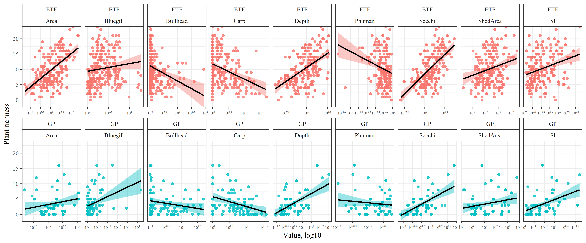

---
output:
  html_document:
    keep_md: yes
    toc: no
    self_contained: no
---

## README


#### Files

All data created in `R\dat_proc.R`.  Source data in the ignore folder were created elsewhere.

* `country.RData` SpatialPolygonsDataFrame of US conterminous state borders

* `fish_dat.RData` Same as `fish_all.RData` but data are converted to CPUE, surveys are Jul/Aug/Sep, and 'standard population assessments' and 'resurveys'.  CPUE is estimated as total fish weight (kg) divided by effort, unique to species, date, lake, and gear type.  CPUE was estimated separately for trapnet, gillnet. Length to weight equations were from the Handbook of Freshwater Fishery Biology. The arguments to `cpue_fun` show the species and gear type combos, including parameters for length/weight conversions.  Bullhead are black and yellow bullhead combined, and crappie are white and black crappie combined. Species are not separated by adult or yoy. 

* `fishveg_dat.RData` combined fisheries and veg data, veg data summarized by total rich and subm rich for each lake.  Fish and veg data combined if the survey was in the same year. Covariates for each lake include UTM coordinates, ecoregion, watershed area, lake depth, lake area, percent human development in watershed, SDI, and secchi depth.   

* `map_dat.RData` Several R objects for creating plots. 

* `mnstate.RData` SpatialPolygonsDataFrame of MN state boundaries

* `veg_dat.RData` DNR veg transect data from 1992 to present. Format is dow, date, transect, species, and abundance category.  NULL abundance entries are not removed, these are species in the survey but not observed on a transect.  Note that there were no lakes in the dataset that had zero veg.  

#### Summary table


Ecoregion   Variable          Ave. (Med.)    Var.      Min./Max.    
----------  ----------------  -------------  --------  -------------
ETF         SpeciesRichness   10.3 (10)      27.6      0 / 24       
            Carp              2.1 (0.4)      23        0 / 45.1     
            Bullhead          1.4 (0.1)      42.6      0 / 87.4     
            Bluegill          1.9 (1.1)      6.7       0 / 18       
            Area              2.5 (1.4)      12.3      0.1 / 22.5   
            Depth             11.2 (9.7)     50.5      1.8 / 34.2   
            Human             0.6 (0.6)      0         0.1 / 1      
            SDI               1.7 (1.5)      0.4       1.1 / 4.4    
            Secchi            1.6 (1.4)      0.7       0.3 / 5.4    
            ShedArea          112.5 (28.9)   77601.3   0.2 / 2808.1 
GP          SpeciesRichness   3.6 (3)        13.6      0 / 16       
            Carp              6.1 (3.7)      47.8      0 / 36       
            Bullhead          5.8 (1.9)      95        0 / 48.4     
            Bluegill          0.5 (0.1)      1.8       0 / 10.8     
            Area              2.3 (1.5)      6.7       0.2 / 10.9   
            Depth             4.7 (3.4)      13.7      1.5 / 25.3   
            Human             0.7 (0.8)      0         0.4 / 0.9    
            SDI               1.7 (1.5)      0.3       1 / 3.5      
            Secchi            0.8 (0.6)      0.4       0.2 / 3.5    
            ShedArea          34.1 (10.8)    2134.9    1.2 / 249.4  


```
##  var      vif             
##  Carp     1.40087938822791
##  Bullhead 1.32609969244421
##  Bluegill 1.2967275170074 
##  Secchi   2.31599398230004
##  SDI      1.34263804704789
##  Human    1.22289758460126
##  Area     1.65132535880825
##  ShedArea 1.61081633407663
##  Depth    2.36527586392161
## 
## All variables have VIF < 10, max VIF 2.37
```

```
## [1] "Carp"     "Bullhead" "Bluegill" "Secchi"   "SDI"      "Human"   
## [7] "Area"     "ShedArea" "Depth"
```

#### Figures


```
## $Dim.1
## $Dim.1$quanti
##          correlation      p.value
## Area       0.7773476 2.020114e-50
## SI         0.7528458 1.138095e-45
## ShedArea   0.6081089 5.767018e-26
## Depth      0.5769222 5.829393e-23
## Secchi     0.4729209 6.044316e-15
## Human     -0.2412841 1.457969e-04
## 
## 
## $Dim.2
## $Dim.2$quanti
##          correlation      p.value
## ShedArea   0.5114765 1.334492e-17
## Human      0.4935204 2.534842e-16
## Area       0.3832484 6.366952e-10
## SI         0.2823737 7.807990e-06
## Depth     -0.6124036 2.093419e-26
## Secchi    -0.7382769 4.217841e-43
## 
## 
## $Dim.3
## $Dim.3$quanti
##          correlation      p.value
## Human      0.7819274 2.238068e-51
## Depth      0.3551340 1.239968e-08
## Secchi     0.2384996 1.747508e-04
## ShedArea   0.2356655 2.096728e-04
## SI        -0.2408795 1.497050e-04
```


```
## 
## Call:
## mrpp(dat = tomod, grouping = d$Group) 
## 
## Dissimilarity index: euclidean 
## Weights for groups:  n 
## 
## Class means and counts:
## 
##       C_abs, B_abs C_abs, B_prs C_prs, B_abs C_prs, B_prs
## delta 2.856        3.569        3.144        2.859       
## n     20           64           28           131         
## 
## Chance corrected within-group agreement A: 0.03333 
## Based on observed delta 3.079 and expected delta 3.185 
## 
## Significance of delta: 0.001 
## Permutation: free
## Number of permutations: 999
```



